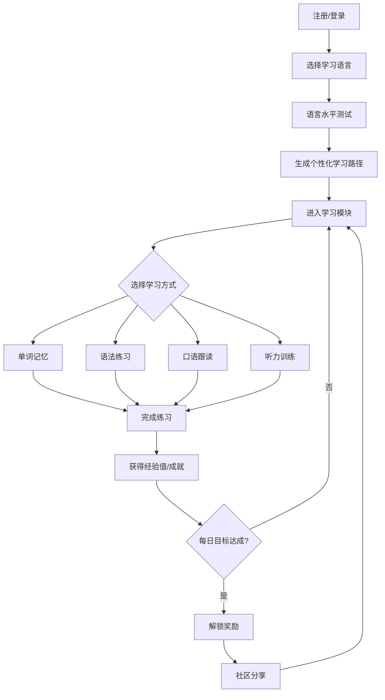
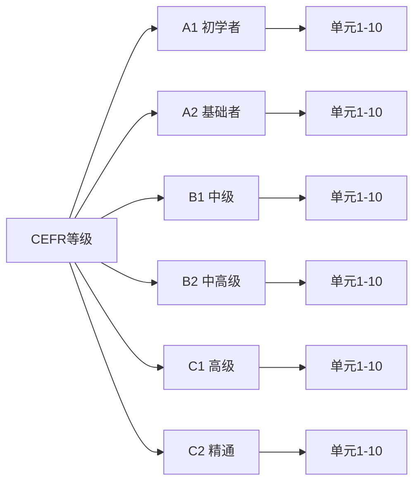

# LinguaFlow 环球语言学堂 - 产品需求文档

## 1. 产品概述

LinguaFlow 是一款沉浸式多语种在线学习平台，涵盖英语、日语、韩语等主流语言，通过游戏化学习机制和个性化路径规划，帮助用户高效掌握新语言。

- **核心目标**：让语言学习变得有趣、沉浸且可坚持
- **目标用户**：语言学习爱好者、学生、职场人士、准备留学或移民的用户
- **市场价值**：融合社区互动与成就激励系统，提升用户留存和学习动力

## 2. 核心功能

### 2.1 用户角色

| 角色 | 注册方式 | 核心权限 |
|------|----------|----------|
| 游客 | - | 浏览课程、体验公开内容 |
| 注册用户 | 邮箱/手机号注册 | 完整学习功能、社区互动、进度追踪 |
| VIP用户 | 付费升级 | 高级课程、一对一辅导、无广告 |

### 2.2 功能模块

1. **首页**：语言选择、课程概览、学习路径推荐、每日挑战入口
2. **学习中心**：分级课程体系、互动学习模块（单词卡、语法练习、口语跟读、听力训练）
3. **个人中心**：学习进度追踪、数据统计、成就徽章、学习路径设置
4. **社区**：语言伙伴匹配、学习日记、话题讨论、问答互助
5. **登录/注册**：多方式注册登录、偏好设置

## 3. 核心流程

### 3.1 用户学习流程

### 3.2 课程体系流程

## 4. 用户界面设计

### 4.1 设计风格

**设计理念：融合东方禅意与西方现代感的"语言探索"美学**

- **主色调**：深靛蓝 `#1a1f3a`（代表深邃与专注）+ 暖橙 `#ff6b35`（代表活力与激励）
- **辅助色**：薄荷绿 `#4ecdc4`（正确/成功）、玫瑰红 `#ff4757`（错误/提醒）、奶油白 `#f8f5f1`（背景）
- **按钮风格**：圆角卡片式按钮，hover时有弹性缩放动画
- **字体**：
  - 标题：Noto Serif SC（衬线体，体现文化底蕴）
  - 正文：Noto Sans SC（无衬线，清晰易读）
  - 数字/统计：DM Sans（现代感）
- **布局风格**：卡片式布局，左侧固定导航，右侧内容区，支持深色/浅色主题切换
- **图标风格**：线性图标 + 微妙的渐变效果

### 4.2 页面设计概览

| 页面名称 | 模块名称 | UI元素 |
|----------|----------|--------|
| 首页 | 语言选择卡片 | 3D悬浮效果、语言国旗图标、学习人数统计 |
| 首页 | 学习路径展示 | 水平滚动卡片、进度指示器 |
| 首页 | 每日挑战入口 | 渐变背景、倒计时动画、奖励预览 |
| 学习中心 | 课程列表 | 等级标签、难度进度条、预计学习时间 |
| 学习中心 | 单词卡模块 | 翻转动画、发音按钮、记忆曲线提示 |
| 学习中心 | 语法练习 | 填空交互、即时反馈动画、解释弹窗 |
| 学习中心 | 口语跟读 | 波形动画、录音按钮、对比播放 |
| 学习中心 | 听力训练 | 进度滑块、倍速控制、原文同步高亮 |
| 个人中心 | 进度仪表盘 | 环形进度图、周报折线图、热量日历 |
| 个人中心 | 成就徽章墙 | 解锁动画、稀有度光效、分享按钮 |
| 社区 | 动态流 | 用户头像、点赞评论、学习日记卡片 |
| 登录/注册 | 表单 | 浮动标签、密码强度指示、第三方登录图标 |

### 4.3 响应式设计

- **桌面端**：多列布局，充分利用屏幕空间
- **平板端**：自适应列数，保持核心功能完整
- **移动端**：单列布局，底部导航栏，触摸优化

### 4.4 动效设计

- **页面切换**：淡入淡出 + 轻微上移，200ms ease-out
- **卡片悬停**：Y轴上移8px + 阴影加深
- **按钮点击**：缩放至0.95 + 弹性恢复
- **进度更新**：数字滚动动画
- **成就解锁**：粒子爆发 + 徽章发光效果
- **加载状态**：骨架屏 + 渐变闪烁

## 5. 数据统计指标

- **日活用户**：DAU
- **用户留存**：次日留存、7日留存、30日留存
- **课程完成率**：各模块完成百分比
- **学习时长**：日均、周均学习分钟数
- **正确率**：各模块答题正确率趋势

## 6. 验收标准

1. 用户可完成注册、登录流程
2. 可选择语言并进入对应课程体系
3. 各学习模块（单词、语法、口语、听力）可正常交互
4. 学习进度可正确记录和显示
5. 成就系统可正常解锁和展示
6. 社区帖子可发布和互动
7. 响应式布局在主流设备上正常显示
8. 动画流畅，无明显卡顿
