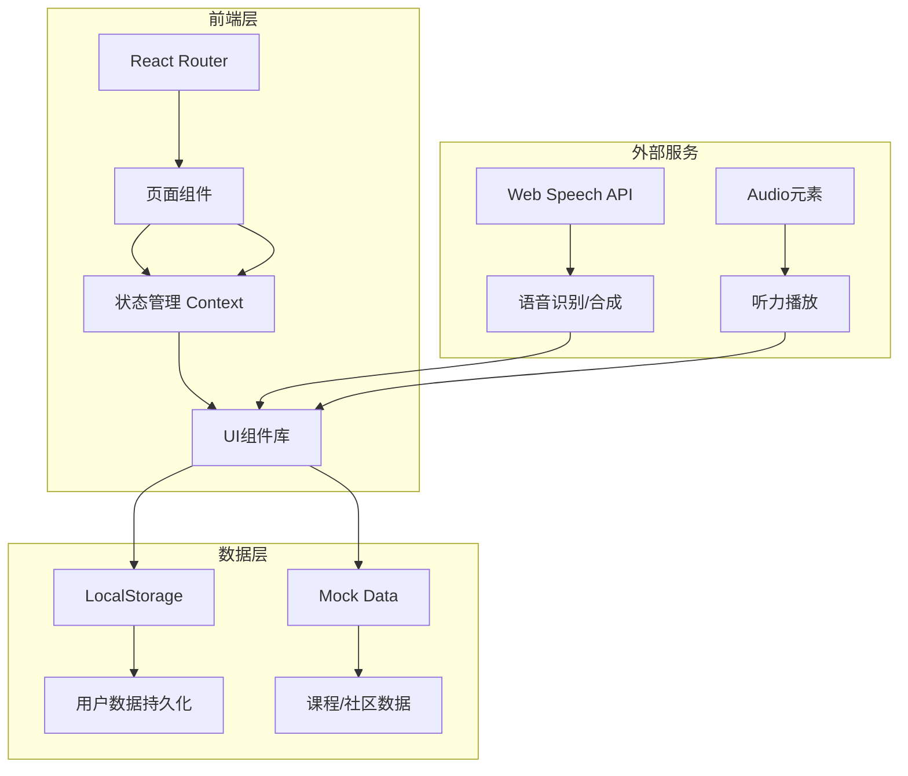

# LinguaFlow 环球语言学堂 - 技术架构文档

## 1. 架构设计



## 2. 技术选型

- **前端框架**：React@18 + Vite
- **样式方案**：Tailwind CSS@3 + 自定义CSS变量
- **路由管理**：React Router DOM v6
- **状态管理**：React Context API
- **数据持久化**：LocalStorage
- **Mock数据**：内置JSON数据模拟后端
- **语音功能**：Web Speech API（口语评测）+ HTML5 Audio（听力播放）
- **图标**：Lucide React
- **动画**：CSS动画 + 自定义过渡效果

## 3. 路由定义

| 路由 | 页面 | 功能描述 |
|------|------|----------|
| `/` | 首页 | 语言选择、推荐课程、每日挑战 |
| `/learn/:language` | 学习中心 | 课程列表、学习模块入口 |
| `/learn/:language/:module` | 学习模块 | 单词卡/语法/口语/听力具体学习 |
| `/profile` | 个人中心 | 进度统计、成就徽章、设置 |
| `/community` | 社区 | 动态流、发帖、话题列表 |
| `/login` | 登录 | 邮箱登录、第三方登录入口 |
| `/register` | 注册 | 用户注册表单 |

## 4. 数据模型

### 4.1 用户数据

```typescript
interface User {
  id: string;
  email: string;
  nickname: string;
  avatar: string;
  level: number;
  exp: number;
  joinDate: string;
  preferredLanguages: string[];
  achievements: string[];
  streak: number; // 连续学习天数
}
```

### 4.2 课程数据

```typescript
interface Course {
  id: string;
  language: 'english' | 'japanese' | 'korean';
  level: 'A1' | 'A2' | 'B1' | 'B2' | 'C1' | 'C2';
  units: Unit[];
}

interface Unit {
  id: string;
  title: string;
  lessons: Lesson[];
  progress: number;
}

interface Lesson {
  id: string;
  type: 'vocabulary' | 'grammar' | 'speaking' | 'listening';
  title: string;
  content: any; // 各类型内容
  completed: boolean;
}
```

### 4.3 进度数据

```typescript
interface Progress {
  userId: string;
  language: string;
  completedLessons: string[];
  correctRate: {
    vocabulary: number;
    grammar: number;
    speaking: number;
    listening: number;
  };
  totalTime: number; // 分钟
  lastStudyDate: string;
}
```

### 4.4 成就数据

```typescript
interface Achievement {
  id: string;
  name: string;
  description: string;
  icon: string;
  rarity: 'common' | 'rare' | 'epic' | 'legendary';
  unlockedAt?: string;
  condition: {
    type: string;
    target: number;
  };
}
```

## 5. 组件结构

```
src/
├── components/
│   ├── common/          # 通用组件
│   │   ├── Button.tsx
│   │   ├── Card.tsx
│   │   ├── Modal.tsx
│   │   ├── ProgressBar.tsx
│   │   └── Toast.tsx
│   ├── layout/          # 布局组件
│   │   ├── Header.tsx
│   │   ├── Sidebar.tsx
│   │   └── BottomNav.tsx
│   ├── learning/       # 学习模块组件
│   │   ├── FlashCard.tsx
│   │   ├── GrammarExercise.tsx
│   │   ├── SpeakingPractice.tsx
│   │   └── ListeningPractice.tsx
│   └── community/      # 社区组件
│       ├── PostCard.tsx
│       └── CommentList.tsx
├── pages/
│   ├── Home.tsx
│   ├── Learn.tsx
│   ├── Module.tsx
│   ├── Profile.tsx
│   ├── Community.tsx
│   ├── Login.tsx
│   └── Register.tsx
├── contexts/
│   ├── AuthContext.tsx
│   ├── LanguageContext.tsx
│   └── ProgressContext.tsx
├── data/
│   ├── courses.ts       # 课程Mock数据
│   ├── achievements.ts  # 成就Mock数据
│   └── community.ts     # 社区Mock数据
├── hooks/
│   ├── useLocalStorage.ts
│   └── useSpeech.ts
└── utils/
    └── helpers.ts
```

## 6. 关键功能实现

### 6.1 语音识别（口语跟读）

使用 Web Speech API 的 `SpeechRecognition` 接口：

```typescript
const useSpeechRecognition = () => {
  const recognition = new (window.SpeechRecognition || window.webkitSpeechRecognition)();
  recognition.lang = 'en-US'; // 根据学习语言动态设置
  recognition.continuous = false;
  // 返回转文字结果用于对比
};
```

### 6.2 听力播放

使用 HTML5 Audio 元素，配合倍速播放：

```typescript
<audio ref={audioRef} playbackRate={speed} src={audioUrl} />
```

### 6.3 进度追踪

使用 Context 配合 LocalStorage 持久化：

```typescript
const ProgressContext = createContext();

const ProgressProvider = ({ children }) => {
  const [progress, setProgress] = useLocalStorage('progress', initialProgress);
  // 计算经验值、等级、连续天数
};
```

## 7. 性能优化

- 使用 `React.lazy` 和 `Suspense` 进行路由懒加载
- 图片使用懒加载
- 使用 `useMemo` 和 `useCallback` 优化重渲染
- CSS动画使用 `transform` 和 `opacity` 触发GPU加速
